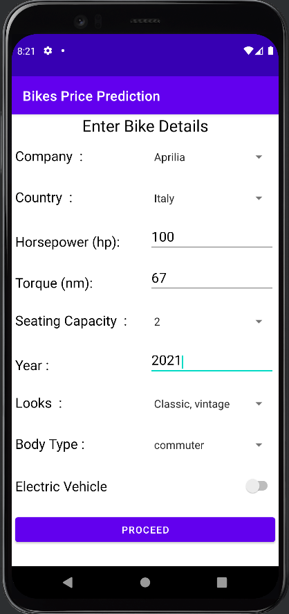
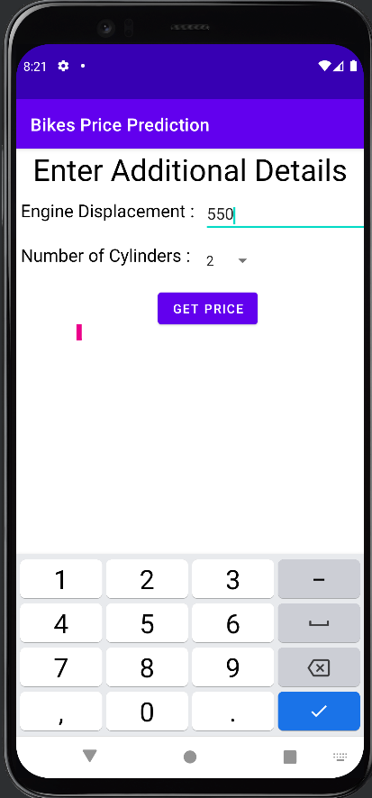
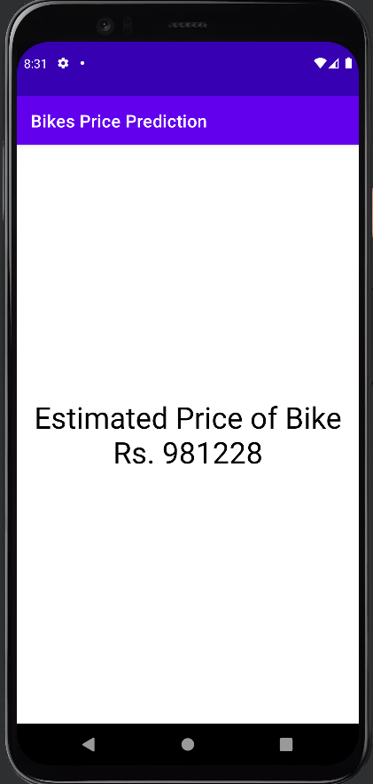
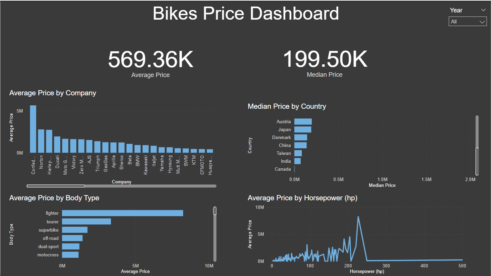

# Bike Price Prediction

This project aims to predict prices of the bikes using various features.
The project will include an android application to access the ml model and a backend service which predicts the price of bike. The Android application and backennd service will be connected to each other using rest api.

### Dataset
The dataset used to train the model is sourced from [kaggle.com](https://www.kaggle.com/datasets/peshimaammuzammil/2023-bike-model-dataset-all-data-you-need)

### Docker Image

Docker Image for ServerProgram has been created and uploaded to [docker registry](https://hub.docker.com/repository/docker/mohitparmar/bikes-price-prediction-serverprogram/general)
To run the program using docker execute the following commands
```
docker pull mohitparmar/bikes-price-prediciton-serverprogram
docker run -itd --network host mohitparmar/bikes-price-prediction-serverprogram
```

### Interface of Android Application

<table>
    <tr>
        <td></td>
        <td></td>
        <td></td>
    </tr>
</table>

### Power BI Dashboard
We have also created a power bi dashboard that helps us in data visualisation
